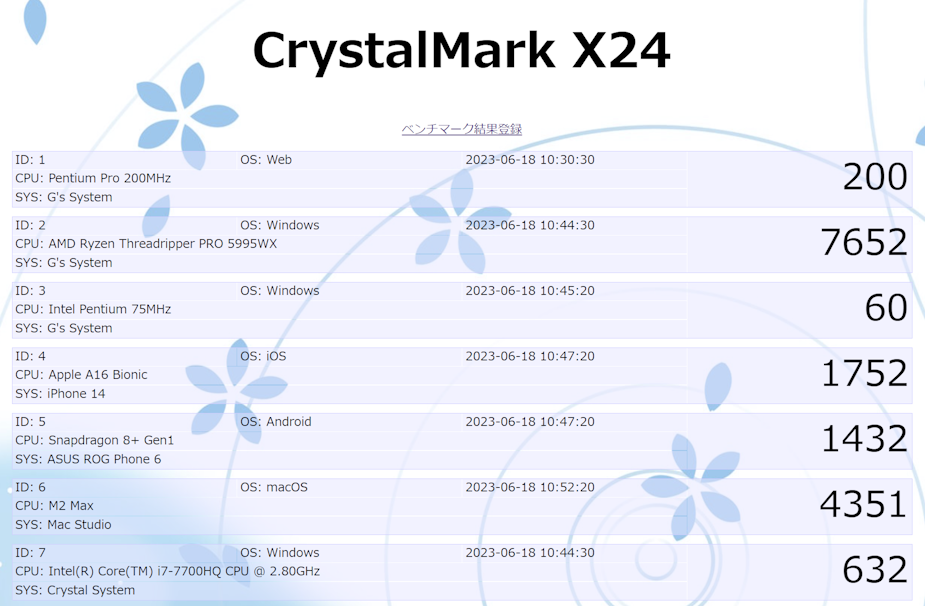

# 課題06 PHP初回

 

## ①課題内容（どんな作品か）
- CrystalMark X24 PHP+Web版

## ②工夫した点・こだわった点
- JavaScriptで行ったベンチマーク結果をテキストに保存するようにしました。

## ③難しかった点・次回トライしたいこと(又は機能)
- ベンチマークスコアでソートする機能や分析する機能を作ります。
- 今後、ネイティブクライアントを作り、サーバーと通信してベンチマーク結果をデータベースに保存する仕組みを作ります。

## ④質問・疑問・感想、シェアしたいこと等なんでも
参考サイト
- [json_decode](https://www.php.net/manual/ja/function.json-decode.php)
